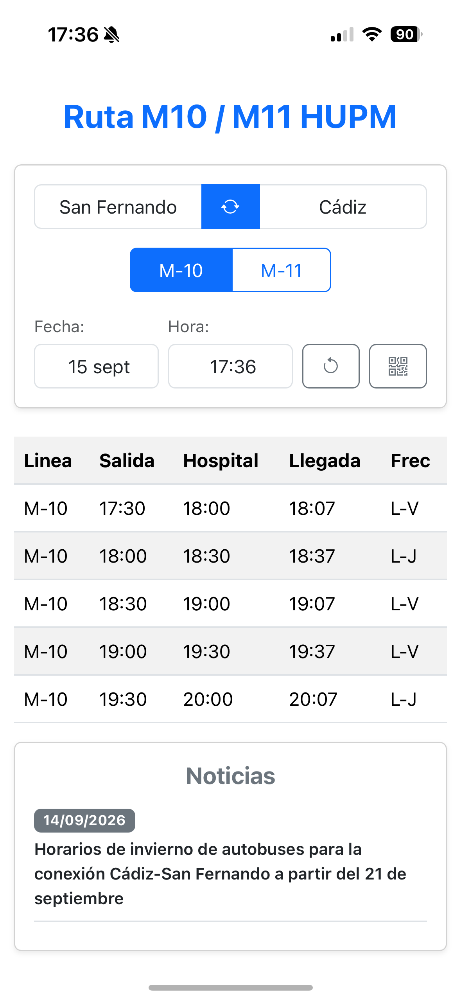
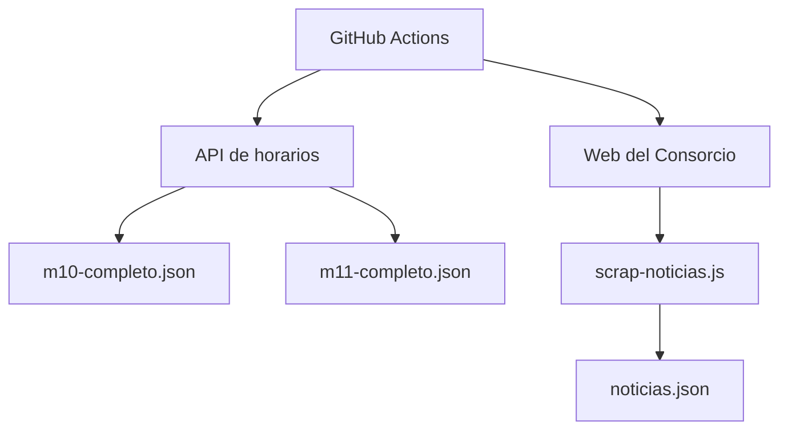

# Bus HUPM - Horarios M-10 / M-11

Aplicación web progresiva para consultar los horarios de las líneas interurbanas M-10 y M-11 entre Cádiz y San Fernando.

**Aplicación:** https://m10hupm.netlify.app/

## Motivación del Proyecto

El Consorcio de Transportes de la Bahía de Cádiz dispone de una web oficial para consultar los horarios de sus líneas. Sin embargo, muestra una gran cantidad de información en una sola pantalla, lo que puede dificultar una consulta rápida desde el móvil.

Este proyecto surge para simplificar esta consulta, mostrando únicamente la información necesaria y permitiendo filtrar los servicios por fecha y hora.

La aplicación ha sido diseñada siguiendo el enfoque de **mobile-first**, priorizando una interfaz sencilla y rápida de consultar desde un dispositivo móvil.

Además de simplificar la consulta, la aplicación incorpora en la misma pantalla información de avisos y noticias del servicio y está diseñada como **PWA** para poder instalarse en el móvil y utilizarse como una aplicación independiente.

El proyecto se encuentra desplegado públicamente y actualmente es utilizado de forma habitual para la consulta de estos horarios.

## Stack Tecnológico Utilizado

El proyecto está desarrollado como una aplicación web ligera, utilizando JavaScript para el procesamiento de los datos procedentes de la API del Consorcio de Transportes de la Bahía de Cádiz, incorporando además procesos automatizados para mantener actualizada la información.

* **Frontend:** HTML5, JavaScript y Bootstrap 5.
* **Datos:** Consumo de la API pública del Consorcio de Transportes de la Bahía de Cádiz.
* **Procesamiento:** JavaScript para el filtrado, transformación y presentación de los horarios.
* **Scraping:** Node.js, Axios y Cheerio para la extracción automatizada de noticias.
* **PWA:** Web App Manifest y Service Worker.
* **Automatización:** GitHub Actions para la actualización periódica de datos.
* **Despliegue:** Netlify.

## Consulta y Procesamiento de Horarios

La aplicación consulta directamente la API del Consorcio de Transportes de la Bahía de Cádiz para obtener los horarios de las líneas M-10 y M-11.

En el despliegue en Netlify, las peticiones a la API se realizan mediante un **proxy configurado en** `netlify.toml`. La API del Consorcio utiliza HTTP, mientras que la aplicación se sirve mediante HTTPS, por lo que las peticiones directas desde el navegador serían bloqueadas por las políticas de seguridad del navegador. El proxy permite realizar estas peticiones a través del mismo origen HTTPS de la aplicación.

Las consultas se realizan de forma independiente para cada día seleccionado por el usuario. A partir de los datos obtenidos, JavaScript procesa y filtra la información para mostrar los servicios disponibles según:

* Línea M-10, M-11 o ambas.
* Origen y destino.
* Fecha.
* Hora de consulta.

El procesamiento se realiza en el frontend, adaptando la información recibida de la API a un formato más sencillo para la consulta del usuario. 

La aplicación realiza además una comprobación para diferenciar si el día seleccionado es festivo o laborable, ya que esta información no está contemplada directamente por la API.

El proyecto dispone además de los datos de las líneas almacenadas en ficheros JSON, cuya actualización está automatizada mediante GitHub Actions. Estos datos forman parte de la infraestructura preparada para una futura evolución de la aplicación hacia un sistema de consulta con caché local y funcionamiento offline.

## Actualización Automática de Datos

El proyecto utiliza **GitHub Actions** para automatizar la actualización de los datos procedentes del Consorcio de Transportes de la Bahía de Cádiz.

El workflow realiza dos procesos independientes:

### Actualización de horarios

Se realizan consultas a la API del Consorcio para obtener los datos completos de las líneas M-10 y M-11.

Los resultados se almacenan en :

* m10-completo.json
* m11-completo.json

Estos ficheros permiten disponer de una copia local de los datos de horarios y forman parte de la evolución prevista del proyecto hacia un sistema de consulta con caché local y funcionamiento offline.

Actualmente, el frontend todavía realiza las consultas directamente contra la API y no utiliza estos ficheros para obtener los horarios.

### Actualización de noticias

La API proporciona los identificadores de las noticias asociadas a las líneas, pero no incluye directamente el contenido de las mismas.

Para obtener esta información se ha desarrollado un scraper con Node.js, Axios y Cheerio, que accede a la web del Consorcio, extrae el contenido de las noticias y los transforma en un formato estructurado.

El workflow ejecuta periódicamente `scrap-noticias.js`, generando y actualizando el fichero `noticias.json`, que posteriormente es utilizado por la aplicación.

### Flujo de actualización

Una vez completados los procesos, el workflow comprueba si se han producido cambios. Si existen novedades, genera automáticamente un commit con los datos actualizados.

## PWA y Experiencia de Usuario

La aplicación está configurada como Progressive Web App (PWA) mediante un Web App Manifest y un Service Worker.

Actualmente, esta configuración permite instalar la aplicación en dispositivos compatibles, utilizando su propio icono y ejecutándose como una aplicación independiente, sin mostrar la barra de navegación del navegador.

El Service Worker está integrado en el proyecto como base para futuras funcionalidades relacionadas con la caché y el funcionamiento offline, pero actualmente las consultas de horarios se realizan directamente contra la API.

También se ha incorporado un **código QR** dentro de la aplicación para facilitar el acceso y la compartición del servicio desde dispositivos móviles.
